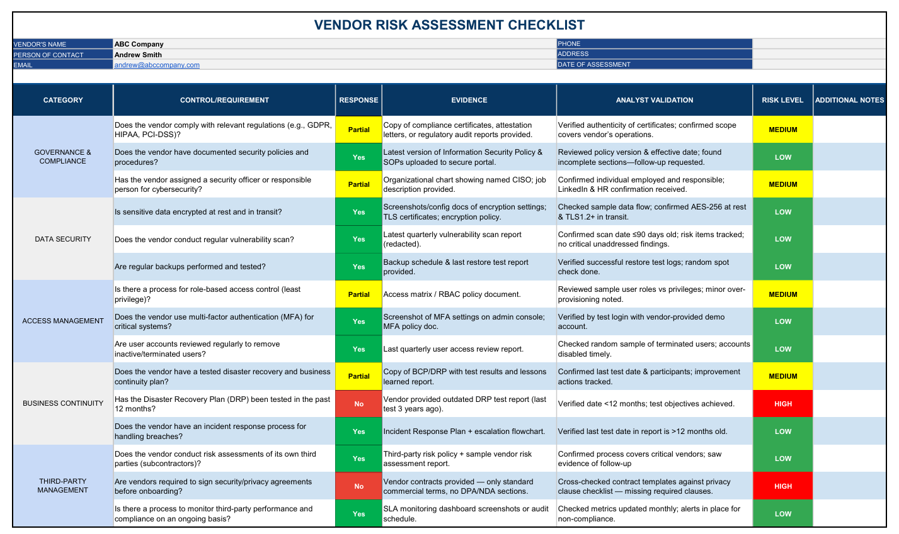

# Vendor Risk Assessment Checklist v1.0

This project is a beginner-friendly **Vendor Risk Assessment Checklist** designed for evaluating third-party vendors against core security and compliance requirements.

✅ Built using **Excel with conditional formatting** (traffic light system for Yes/No/Partial and Risk Levels).  
✅ Aligned with **NIST CSF 2.0** functions: Governance, Data Security, Access Management, Business Continuity, and Third-Party Management.  
✅ Includes **columns for Vendor Response, Evidence, Analyst Validation, and Risk Level** to mimic real-world TPRM workflows.

## 📂 Files in this Repository
- `Vendor_Risk_Assessment_Checklist_v1.xlsx` → Editable Excel file with dropdowns and conditional formatting.
- `Vendor_Risk_Assessment_Checklist_v1.pdf` → PDF version for quick viewing and sharing.

## 📌 Example Use Case
This checklist can be used to:
- Evaluate new vendors during onboarding.
- Validate vendor security claims with evidence.
- Identify gaps in vendor compliance and assign risk levels.

## 🚀 Next Steps
Future updates may include:
- Automated scoring system (risk scorecard).
- More detailed control requirements (ISO 27001 & SOC 2 alignment).

---

👤 Created by [Carlo Buensalida](https://github.com/carlobuensalida)  
Aspiring Third-Party Risk Analyst | Cybersecurity GRC Enthusiast

